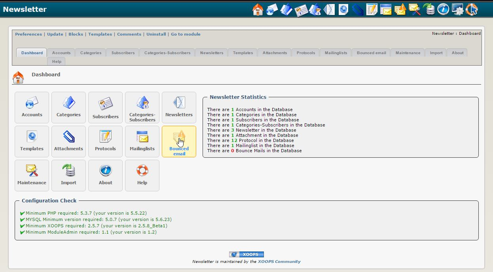

### _XOOPS Documentation Series_

# Module xNewsletter
#### for XOOPS 2.5.7
      

            
Version: xNewsletter 1.2 Final
            
## User Manual

© 2015 XOOPS Project ([www.xoops.org](http://xoops.org))   

## Module Purpose 

This module is a Newsletter module for XOOPS created by Goffy.

*Figure 1: Main view of the xNewsletter Module (Admin side)*

## Key Features:

- Usage of one or more e-mail-accounts
- Admin of one or more newsletter possible
- Subscription procedure optionally use confirmation system (double-opt-in)
- Detailed handling of permissions for subscription procedures
- Newsletters are based on templates
- Detailed handling of permissions for groups and newsletter (subscribe, write, send)
- Send: send test mail, resend to all subscribers or only to subscribers, where sending failed
- Sending newsletters to unlimited number of recipients or in packages with certain number of recipients by using cronjob
- Bounced email handler for handling Bounced emails in case of invalid e-mail-addresses
- Optional synchronization with mailing lists (e.g. majordomo)
- Maintenance function included
- Creating protocol for the important steps

## Download/Fork the Module  

**You can fork the module --> [here](https://github.com/XoopsModules25x/xnewsletter))** 

## How to Contribute

[You can contribute on GitHub](https://github.com/XoopsDocs/xnewsletter-tutorial). Changes will be [pushed to Gitbook.io automatically](https://www.gitbook.com/book/xoops/xnewsletter-tutorial/activity) when the [main repository](https://github.com/XoopsDocs/xnewsletter-tutorial) changes.

Editing the book can be done either by updating the markdown files with a text editor, or opening the repository in [the Gitbook desktop app](https://github.com/GitbookIO/editor/blob/master/README.md). The desktop app will give you a live preview option.

# Table of Content

* [Introduction](README.md)
* [Install/Uninstall](en/book/1install.md)
* [Administration Menu](en/book/2administration.md)
   * [Accounts](en/book/accounts.md)
   * [Categories](en/book/categories.md)
   * [Subscribers](en/book/subscribers.md)
   * [Categories-Subscribers](en/book/categories-subscribers.md)
   * [Newsletters](en/book/newsletters.md)
   * [Attachments](en/book/attachments.md)
   * [Protocols](en/book/protocols.md)
   * [Mailing lists](en/book/mailing_lists.md)
   * [Task list](en/book/tasklist_md.md)
   * [Bounced email handler](en/book/bounced_email_handler.md)
   * [Maintenance](en/book/maintenance.md)
   * [Import](en/book/import.md)
   * [About](en/book/about.md)
   * [Help](en/book/help.md)
* [Preferences](en/book/3preferencesmd.md)
* [Operating Instructions](en/book/4operations.md)
* [The User Side](en/book/5userside.md)
* [Blocks](en/book/6blocks.md)
* [Templates](en/book/7templates.md)
* [Miscellaneous](en/book/8other.md) 
* [Module Credits](en/book/9credits.md)
* [About XOOPS CMS](en/book/10aboutxoops.md)

##License:

 Unless specified, this content is licensed under a <a rel="license" href="http://creativecommons.org/licenses/by-nc-sa/4.0/">Creative Commons Attribution-NonCommercial-ShareAlike 4.0 International License</a>.

All derivative works are to be attributed to XOOPS Project ([www.xoops.org](http://xoops.org))
