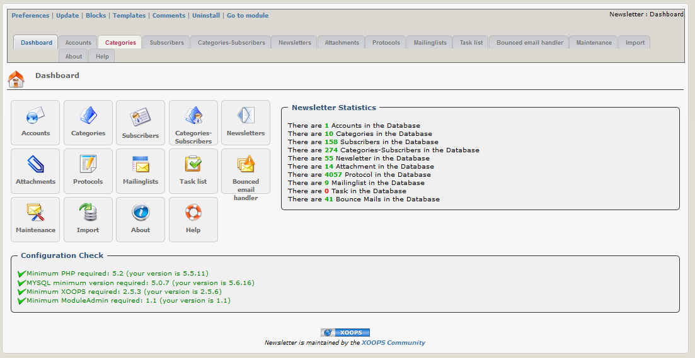

# Administration Menu

On the xnewsletter dashboard you get a short overview about the functionalities and the content of the module.

## Functionalities for admins:

* [Accounts](https://github.com/xoops/xnewsletter-tutorial/tree/003df5c84bfa0e0335b10f1f484abc2c8e9cc3b2/en/book/book/accounts.md)
* [Categories](https://github.com/xoops/xnewsletter-tutorial/tree/003df5c84bfa0e0335b10f1f484abc2c8e9cc3b2/en/book/book/categories.md)
* [Subscribers](https://github.com/xoops/xnewsletter-tutorial/tree/003df5c84bfa0e0335b10f1f484abc2c8e9cc3b2/en/book/book/subscribers.md)
* [Categories-Subscribers](https://github.com/xoops/xnewsletter-tutorial/tree/003df5c84bfa0e0335b10f1f484abc2c8e9cc3b2/en/book/book/categories-subscribers.md)
* [Newsletters](https://github.com/xoops/xnewsletter-tutorial/tree/003df5c84bfa0e0335b10f1f484abc2c8e9cc3b2/en/book/book/attachments.md)
* [Protocols](https://github.com/xoops/xnewsletter-tutorial/tree/003df5c84bfa0e0335b10f1f484abc2c8e9cc3b2/en/book/book/protocols.md)
* [Mailinglists](https://github.com/xoops/xnewsletter-tutorial/tree/003df5c84bfa0e0335b10f1f484abc2c8e9cc3b2/en/book/book/mailinglists.md)
* [Tasklists](https://github.com/xoops/xnewsletter-tutorial/tree/003df5c84bfa0e0335b10f1f484abc2c8e9cc3b2/en/book/book/tasklist.md)
* [Bounced email handler](https://github.com/xoops/xnewsletter-tutorial/tree/003df5c84bfa0e0335b10f1f484abc2c8e9cc3b2/en/book/book/bounced_email_handler.md)
* [Maintenance](https://github.com/xoops/xnewsletter-tutorial/tree/003df5c84bfa0e0335b10f1f484abc2c8e9cc3b2/en/book/book/maintenance.md)
* [Import](https://github.com/xoops/xnewsletter-tutorial/tree/003df5c84bfa0e0335b10f1f484abc2c8e9cc3b2/en/book/book/import.md)
* [About](https://github.com/xoops/xnewsletter-tutorial/tree/003df5c84bfa0e0335b10f1f484abc2c8e9cc3b2/en/book/book/about.md)
* [Help](https://github.com/xoops/xnewsletter-tutorial/tree/003df5c84bfa0e0335b10f1f484abc2c8e9cc3b2/en/book/book/help.md)

