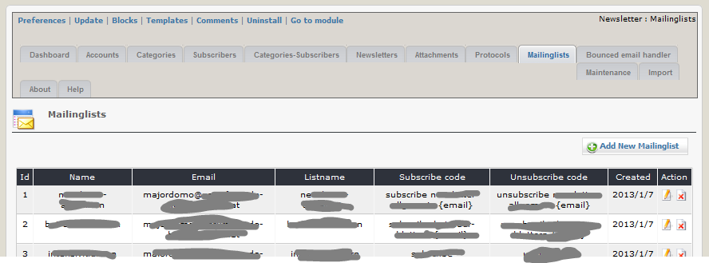
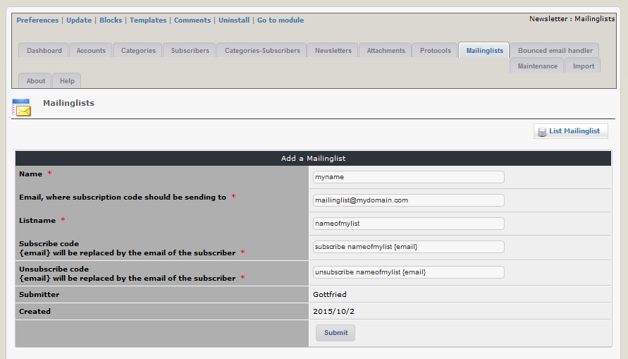

# Mailing lists

On this tab you can see an overview of the existing mailing lists. This tab is only visible, if "Use additional feature mailing lists" in module preferences is set to "yes".

You can add a new mailing list to newsletter module.  You have to define the email address, where the command for synchronization have to be sent and the command himself. This structure is prepared for majordomo mailing list, so for other mailing list it can be necessary to adopt the commands.

