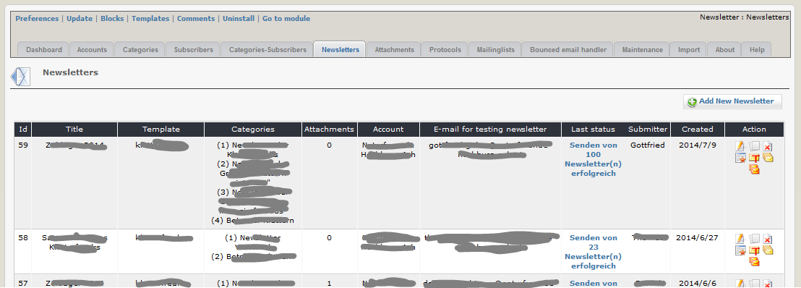
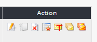

# Newsletters

On this tab you can see an overview of your existing newsletters. 

In this list you can see also

* the used template     
* the cats to which the newsletter was sent
* the number of attachments of this newsletter
* the account used for sending
* E-mail for testing newsletter
* the last status in your protocols

## Column Action

Possible actions for a newsletter are

*  edit
*  clone
*  delete
*  show preview
*  send test to defined test email address
*  send to all subscribers of this cat
*  resend newsletter only to subscribers, where last try to send failed

