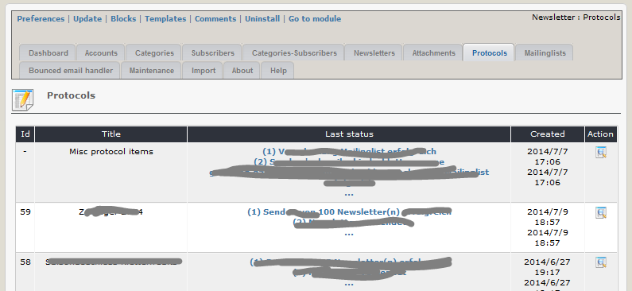
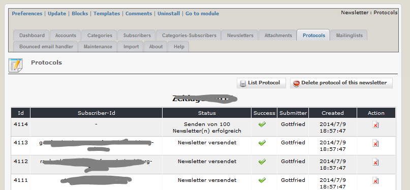

# Protocols

On this tab you can see an overview of the actions of newsletter module.

## Misc protocol items

Under misc protocol items you find the documentation about all activities, which are not related to a newsletter, e.g. subscription, synchronization of mailing lists, maintenance of module, and so on.

## Newsletter items

For each newsletter you can see various protocol items for

* creation and saving the newsletter
* sending activities for each subscriber \(successful/failed\)
* summary protocol for last sending
* and so on

