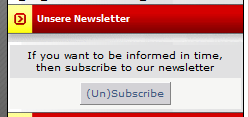

# Blocks

xnewsletters offers various blocks:

* standard block for subscription  

  

* actual subscriptions
* subscriptions of today
* actual newsletters
* newsletters of today
* random newsletters

