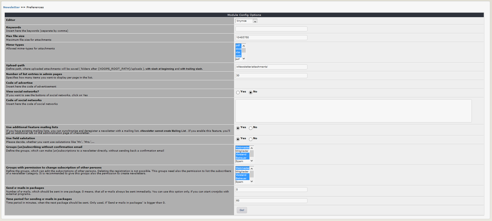

# 3.0 Preferences

In the module preferences you can set various options for this module: 

## Options in detail
### Editor
You can decide, which editor should be used for the creation of a newsletter on user side.

### Keywords
You can add keywords, which are added to the meta tags. Seperate the keywords by comma.

### Maximum file size
Please define the maximum file size for attachments to a newsletter. You have to enter the value for bytes (10485760 = 1 MB).

### Mime-Types
Define which mime-types are allowed for attachments.

### Upload path
Define path, where uploaded attachments will be saved ( folders after {XOOPS_ROOT_PATH}/uploads ), with slash at beginning and with trailing slash. 
**Attention:** make sure, that this path is really existing - xnewsletter will not create this path/folders

### Number of list entries in admin pages
Specifies how many items you want to display per page in the list.
	

### Code of advertise
Insert here the code of advertisement
	

### View social networks?
If you want to see the buttons of social networks, click on Yes

### Code of social networks
Insert here the code of social networks
	
### Use additional feature mailing lists
If you have existing mailing lists, you can synchronize the subscribers of a newsletter category with a mailing list.  xnewsletter cannot create mailing lists. If you enable this feature, you'll get an additional tab on the administration page of xnewsletter.

### Use field salutation
Please decide, whether you want use salutations like 'Mr.', 'Mrs.',...

### Groups (un)subscribing without confirmation email
Define the groups, which can make (un)subscriptions to a newsletter directly, without sending back a confirmation email
	
### Groups with permission to change subscription of other persons
Define the groups, which can edit the subscriptions of other persons. Deleting the registration is not possible. This groups need also the permission to list the subscribers of a newsletter category. It is recommended to give this groups also the permission to create newsletters.
	
### Send e-mails in packages
Number of e-mails, which should be sent in one package. 0 means, that all e-mails always be sent immediatly. You can use this option only, if you can start cronjobs with external programs.
	
### Time period for sending e-mails in packages
Time period in minutes, when the next package should be sent. Only used, if 'Send e-mails in packages' is bigger than 0.

