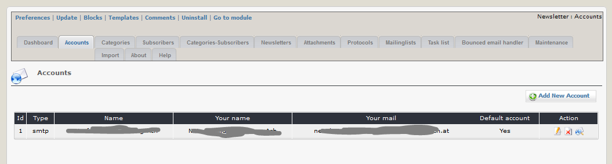
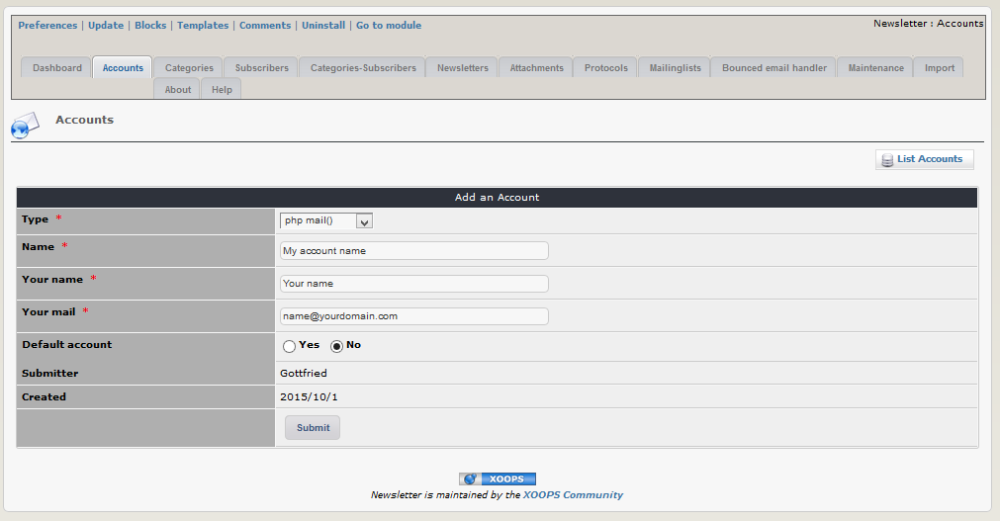
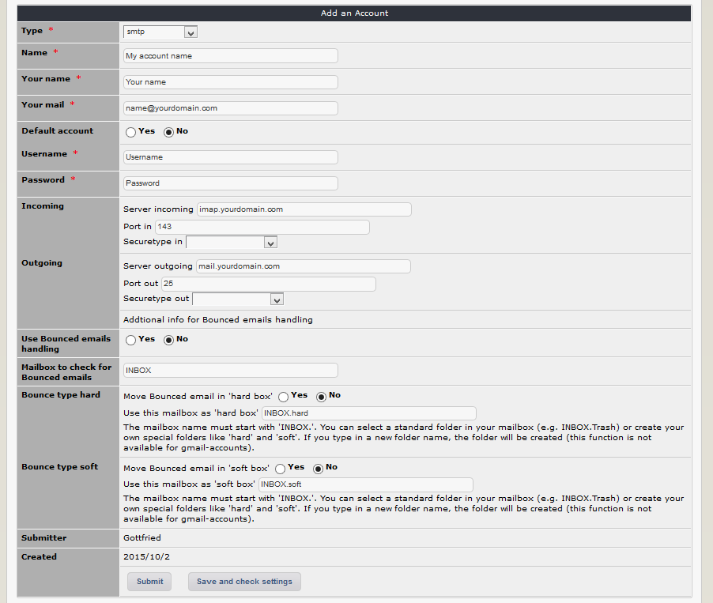
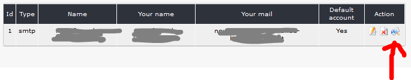

## 2.1 Accounts

On this tab you can see an overview of your existing accounts.
You can use one or more email accounts for sending the newsletters.

You have the possibility to create an account for sending
* with php mail() function
* with php sendmail() function
* via a pop3 email account
* via a smtp email account
* via a google email account

##### Example for an account using php mail() function

##### Example for an account using a smtp mail account

If you use a smtp or google account, you can also use bounced email handler (BMH) function.
If you use BMH, you have to define, what should happen with bounced mails.
If you want to move them to special folders of your email account, you have to define this folders. You can select a standard folder in your mailbox (e.g. INBOX.Trash) or create your own special folders like 'hard' and 'soft'. If you type in a new folder name, the folder will be automatically created (this function is not available for gmail-accounts). 

#### Test your settings
There is a feature for testing pop3 and imap/smtp accounts.

After starting the test you will see, whether the account and your chosen setting are well.

> **Pay attention:** 
1. **xnewsletter is not creating an email account** - the account must already exist
2. functions like testing account, sending emails, start Bounced email handler,... work not with local server (you get white page without any error)