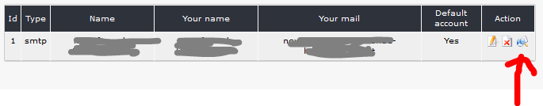

## 4.1 Accounts

You can use one or more email-accounts; sending with php mail, php sendmail, smtp is possible.

There is a feature for testing pop3 and imap accounts.

After starting the test you will see, whether the account and your choosen setting are well.

**Pay attention:** 
1. **xnewsletter is not creating an email account** - the account must already exist
2. functions like testing account, sending emails, start Bounced email handler,... work not with local server (you get white page without any error).