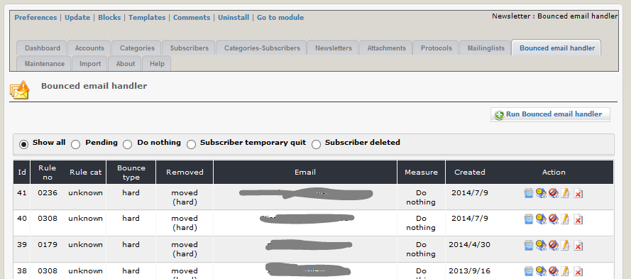
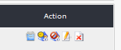

# 2.10 Bounced email handler (BMH)
If you send newsletters, there will always be some emails not delivered to recipient (Bounced email), because email is no more valid, mailbox is full, and so on.
To handle this event and to react on this, you can use BMH.
You can activate BMH for each account.
Mails, which are detected as Bounced emails by BMH, can be deleted or moved in a special folder, you have to define.

In this tab you can see an overview of the results of the last run BMH.

If you run BMH, the module will check your email account for bounced mails.
Mails, which are detected as bounced emails by BMH, can be deleted or moved in a special folder, you have to define.

#### Types of Bounced emails
**bounce type hard:** This means that there is a permanent error when sending a mail, e.g. unknown recipient, unknown domain, and so on.
This mails will be deleted after detection, so it is recommended using the move hard option (the email will be only moved in this folder, you can check this mail later, if you want).

**bounce type soft:**
This means that there is a temporary problem with sending a mail, e.g. mailbox full, server not available, and so on.
This mails will not be deleted after detection, but it is recommended using the move soft option in order to keep your basic in box clean.

Pay attention: functions like testing account, sending emails, start Bounced email handler,... work not with local server (you get white page).

#### Possible reaction on bounced mails

If mails to a subscriber get bounced, you can decide, what should happen with the subscriber:
* If it is a permanent problem (e.g. email address isn't existing anymore) it is recommended to delete the subscriber ()
* If it is a temporary problem (e.g. mailbox full) it is recommended to quit the subscriber. He can reactivate late his subscriptions ()