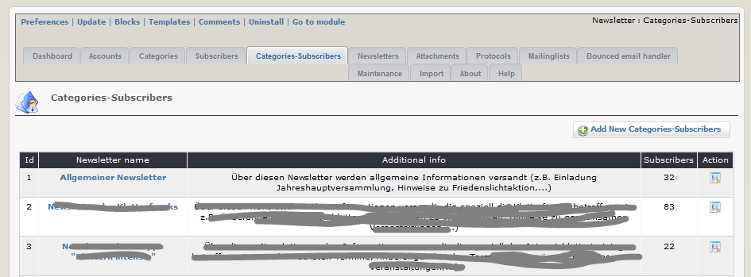
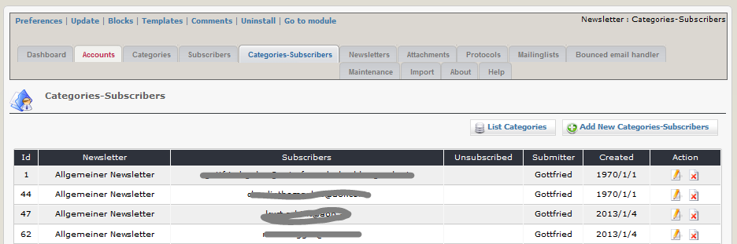
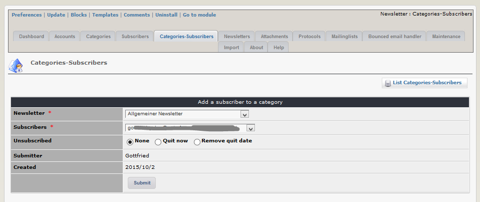

# 2.4 Categories-Subscribers

On this tab you can see an overview of your newsletter cats.

You can see also in the column "Subscribers" the number of subscribers for this cat.

If you click on the cat name or on "details" ()you get the list with the subscribers

If you want, you can also subscribe one person to one newsletter cat manually

If you quit a subscription by bounced mail handler, you can see the date of quitting