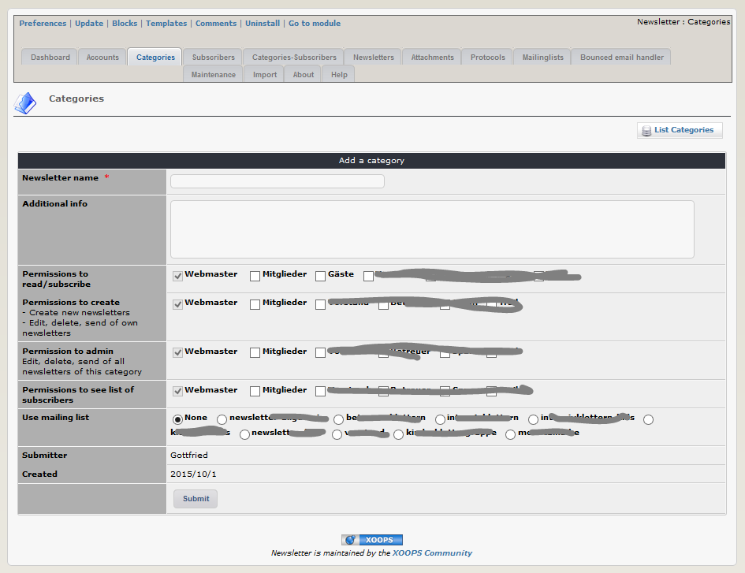

# Newsletter categories

You can handle one or more newsletter categories. 

It is possible to set permissions to "read", "create", "admin" and "list subscribers" for each newsletter cat per user group.

If you have chosen the option for the usage of mailing lists and you have already defined the mailing lists, you can here decide, with which mailing list (un-)subscriptions should be syncronized.

