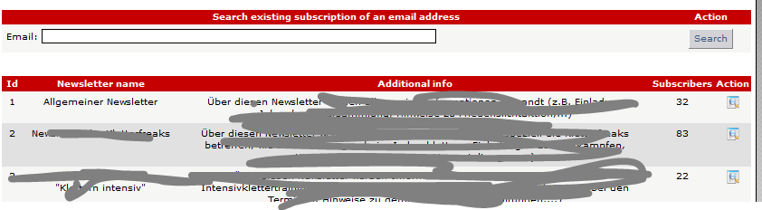
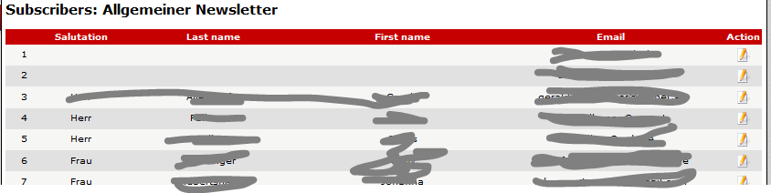

# 5.4 List subscribers

If current user has the right to list subscribers of a newsletter, he get a list of newsletter cats, where he has this right

If you click  on "Show Details" (column Action) you get the list of all subscribers to this newsletter cat
