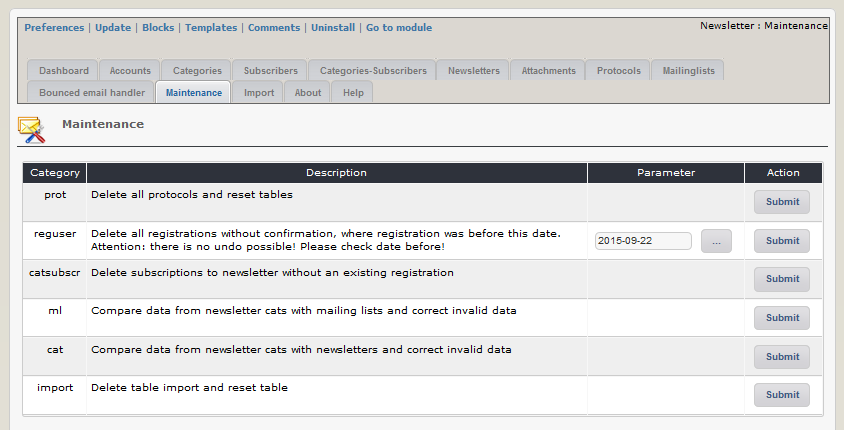

# 2.11 Maintainance

This module has a maintain function, which can repair several faults in the data.

In order to keep the database clean and small, it is recommended to run the maintenance from time to time.