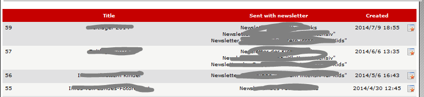
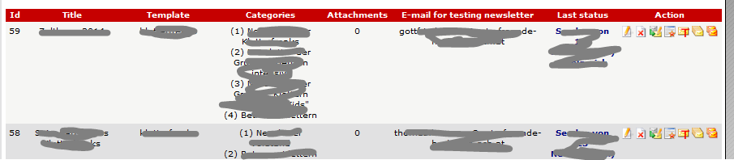

# 5.1 Newsletter list

The user get a list of all newsletter already sent, but he can only see all newsletter cats, where his groups has the right to read.

The user can also see a preview of the newsletter.

Depending to the rights of current user, he can have more information possibilities (edit, delete, send,...) 

For more info see also 

