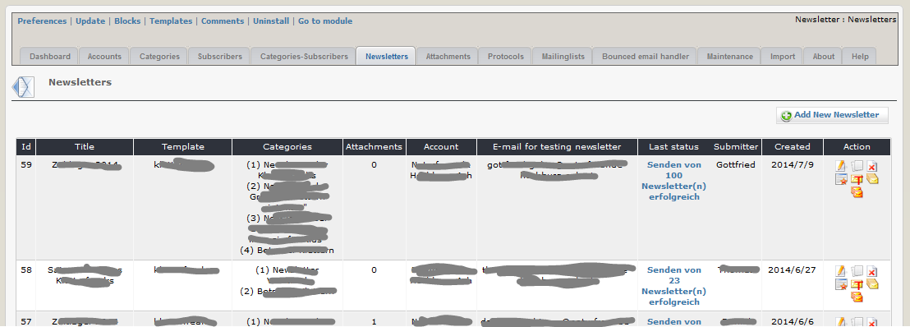
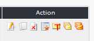

# 2.5 Newsletters

On this tab you can see an overview of your existing newsletters.

In this list you can see also
* the used template 	
* the cats to which the newsletter was sent
* the number of attachments of this newsletter
* the account used for sending
* E-mail for testing newsletter
* the last status in your protocols

#### Column Action

