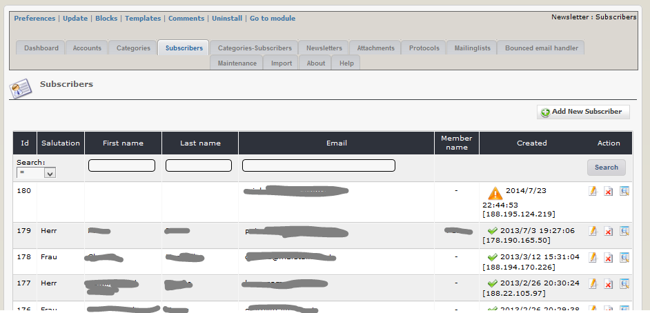
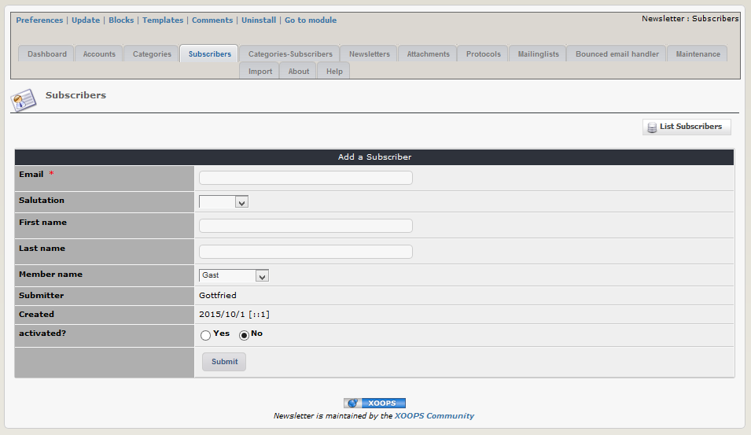

# 2.3 Subscribers

Each subscriber will be stored in the database once. After storing the person, he/she can subscribe to one or more newsletter cats.

On this tab you can see a list of all persons, which have subscribed to minimum one newsletter.

 
You have also the possibility to add a person manually to the database.

