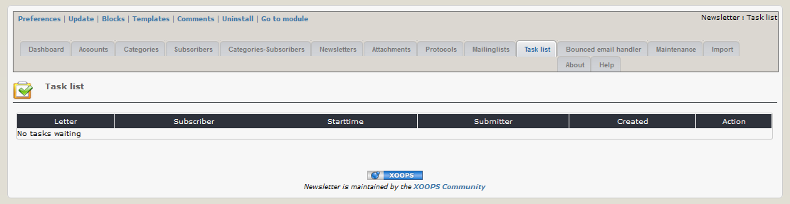

# 2.9 Task list

On this tab you can see an overview of the existing tasks (for sending a newsletter). This tab is only visible, if "Send e-mails in packages" in module preferences is greater than 0.

If you use this option, you can see all newsletters waiting for next cronjob and the time, when cronjob can send the newsletter. 

