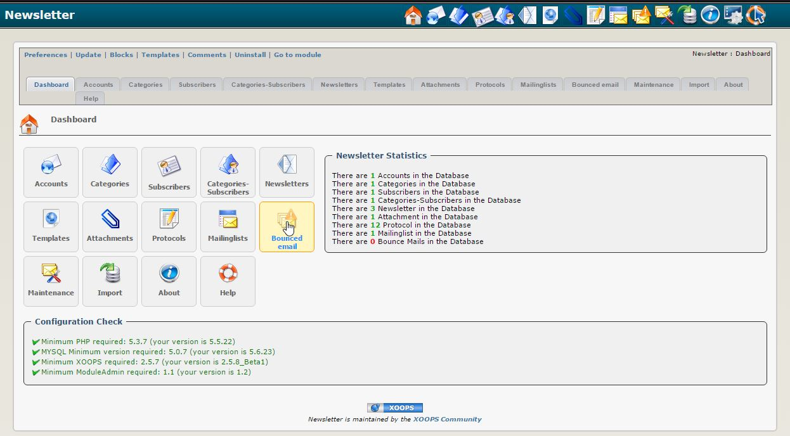

### _XOOPS Documentation Series_

# Modul xNewsletter
#### für XOOPS 2.5.7
      

Version: xNewsletter 1.2 Final
            
## Benutzerhandbuch

© 2015 XOOPS Project ([www.xoops.org](http://xoops.org))   

## Beschreibung des Modules 

Dieses Modul ist ein Newslettermodul für Xoops, erstellt von Goffy.

*Abbildung 1: Hauptübersicht des xNewsletter Moduls (Administrationsbereich)*

## Grundsätzliche Funktionen:

- Verwendung mehrere E-Mail-Konten möglich
- Verwaltung mehrerer Newsletter möglich
- Anmeldeverfahren optional mit Bestätigungsverfahren (double-opt-in)
- Detailierte Rechteverwaltung für Anmeldeverfahren
- Newsletter templatebasiert
- Detailierte Rechteverwaltung je Gruppe und Newsletter (Abonnieren/Lesen, Schreiben, Senden)
- Senden: testweises Senden, Wiederholung des Sendevorganges für alle Empfänger oder nur für fehlgeschlagene Sendevorgänge
- Der Newsletter kann an eine unlimitiert Anzahl an Empfängern versendet werden oder in Paketen mit einer bestimmten Anzahl an Empfängern durch Verwendung eines Cronjobs
- Bounced mail handler für die Verwaltung der ungültigen/nicht mehr gültigen E-Mail-Adressen
- Optional Syncronisierung mit Mailinglisten (z.B. majordomo)
- Wartungsfunktion enthalten
- Protokollierung der wichtigsten Vorgänge

# Inhaltsverzeichnis

* [Einleitung](README.md)
* [(De-)Installation](book/1install.md)
* [Administration Menü](book/2administration.md)
   * [E-Mail-Konten](book/accounts.md)
   * [Kategorien](book/categories.md)
   * [Abonnenten](book/subscribers.md)
   * [Kategorie-Abonnenten](book/categories-subscribers.md)
   * [Newsletter](book/newsletters.md)
   * [Anhänge](book/attachments.md)
   * [Protokolle](book/protocols.md)
   * [Mailinglisten](book/mailing_lists.md)
   * [Aufgabenlisten](book/tasklist_md.md)
   * [Bounced email handler](book/bounced_email_handler.md)
   * [Wartung](book/maintenance.md)
   * [Import](book/import.md)
   * [Über](book/about.md)
   * [Hilfe](book/help.md)
* [Einstellungen](book/3preferencesmd.md)
* [Anwendungshinweise](book/4operations.md)
* [Benutzerbereich](book/5userside.md)
* [Blöcke](book/6blocks.md)
* [Templates](book/7templates.md)
* [Modul Credits](book/9credits.md)
* [About Xoops](book/10aboutxoops.md)

##Lizenzen:

 Vorbehaltlich anderer Hinweise unterliegt dieser Inhalt den Bestimmungen gemäß <a rel="license" href="http://creativecommons.org/licenses/by-nc-sa/4.0/">Creative Commons Attribution-NonCommercial-ShareAlike 4.0 International License</a>.

Alle Abwandlungen sind derivate von XOOPS Project ([www.xoops.org](http://xoops.org)) 

