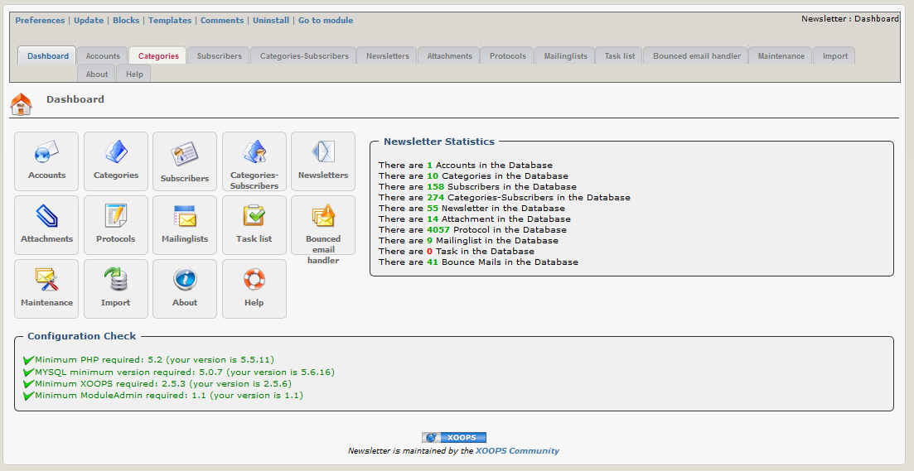

# 2.0 Administrationsmenü

In der xnewsletter-Hauptübersicht erhalten sie eine kurze Übersicht über die Funktionalitäten und den Inhalt des Moduls.

## Funktionalitäten für die Administration:
* [E-Mail-Konten](accounts.md)
* [Kategorien](categories.md)
* [Abonnenten](subscribers.md)
* [Kategorie-Abonnenten](categories-subscribers.md)
* [Newsletter](attachments.md)
* [Protokolle](protocols.md)
* [Mailinglisten](mailinglists.md)
* [Aufgabenlisten](tasklist.md)
* [Bounced email handler](bounced_email_handler.md)
* [Wartung](maintenance.md)
* [Import](import.md)
* [Über](about.md)
* [Hilfe](help.md)