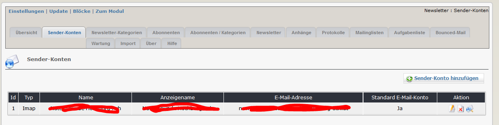
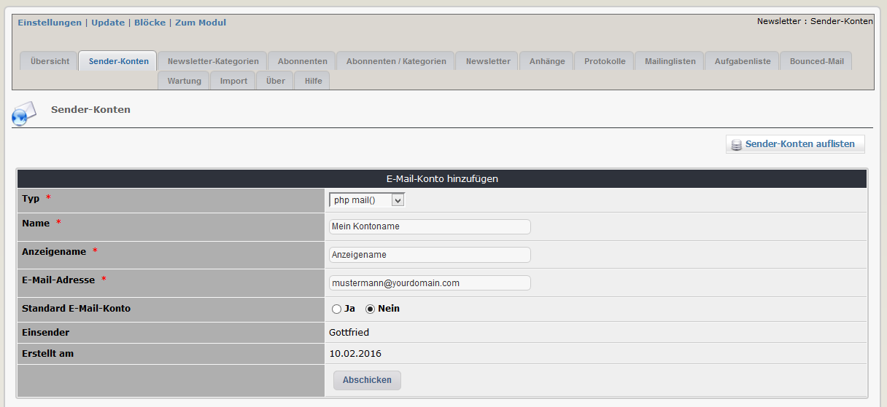
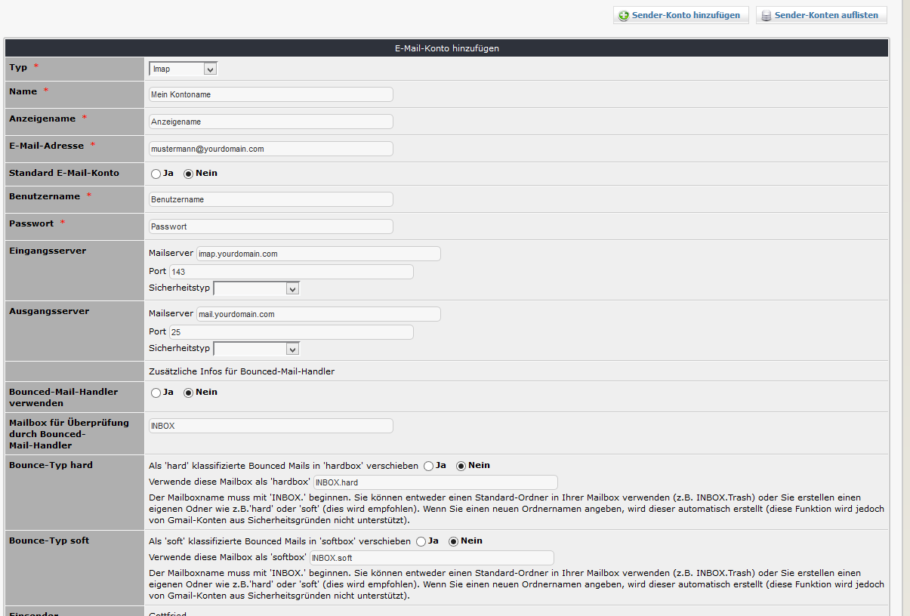
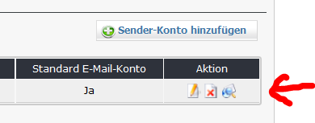

## 2.1 E_Mail-Konten

Auf diesem Registerblatt finden sie eine Übersicht über die derzeit existierenden Konten.
Sie können ein oder mehrere E-Mail-Konten zum Versenden der Newsletter verwenden.

Sie haben bei der Erstellung eines Kontos folgende Möglichkeiten:
Senden 
* mit der Funktion php mail() 
* mit der Funktion php sendmail()
* über ein pop3-EMail-Konto
* über ein smtp-EMail-Konto
* über ein google-EMail-Konto

##### Beispiel für ein Konto mit Verwendung der Funktion php mail()

##### Beispiel für ein Konto mit Verwendung eines smtp-EMail-Konto

Wenn sie ein smtp oder google-Konto verwenden, können sie auch die Funktion Bounced email handler (BMH) verwenden.
Wenn sie den BMH verwenden wollen, müssen sie hier definieren, was mit zurückgewiesenen Mails passieren soll.
Wenn sie die Mails in einen speziellen Ordner verschieben lassen wollen, dann müssen sie dies hier definieren.
Sie können einen Standardordner (wie z.B. den Papierkorb INBOX.Trash) verwenden oder dafür eigene Ordner wie 'hard' und 'soft' erstellen. Wenn sie einen neuen Ordnernamen angeben, wird dieser Ordner auch automatisch erstellt (diese Funktion ist bei GMail-Konten aber nicht möglich). 

#### Testen der Einstellungen
Diese Funktion dient zum testen der pop3 und imap/smtp Konten.

Nach dem Start des Tests () wird ihnen angezeigt, ob die von ihnen gewählten/angegebenen Einstellungen funktionieren.

> **Bitte beachten sie:** 
1. **xnewsletter erstellt keine EMail-Konten** - das EMail-Konto muss bereits vorhanden sein
2. Funktionen wie das Testen der Email-Konten, das Senden von Mails, das Starten des Bounced email handler,... funktionieren nicht mit einem lokalen Server (sie erhalten weiße Seiten)