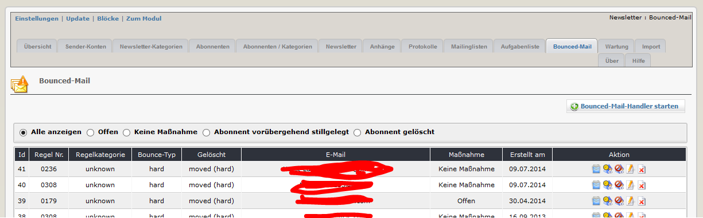
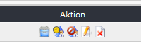

# 2.10 Bounced email handler (BMH)
Wenn Sie Newsletter versenden, wird es immer wieder vorkommen, dass einzelne Mails nicht zugestellt werden können (bounced mails), weil z.B. die E-Mail-Adresse nicht mehr gültig ist, weil die Mailbox voll ist, usw.
Um solche Ereignisse zu verarbeiten und auch darauf zu reagieren, können Sie den BMH verwenden. Sie können den BMH für jedes einzelne E-Mail-Konto aktivieren.
Nicht zustellbare Mails, die vom BMH als solche erkannt werden, können gelöscht oder in einen dafür vorgesehenen Ordner verschoben werden.

Auf diesem Registerblatt sehen sie eine Übersicht über die Ergebnisse des letzten Durchlaufs des BMH

Wenn sie den BMH starteen, wird das Modul ihr Email-Konto nach zurückgewiesene Emails durchsuchen.
Mails, die als zurückgewiesen erkannt wurden, können gelöscht oder in die von ihnen definierten Ordner verschoben werden. 

#### Arten von Bounced emails
**bounce type hard:** Dies bedeutet, dass ein ständiger Fehler vorliegt, z.B. Empfänger unbekannt, Domain unbekannt, usw.
Diese Mails werden nach Entdeckung/Klassifizierung als Typ hard gelöscht, deshalb wird empfohlen, die movehard-Option zu verwenden (die Mails werden dann nur in diesen Ordner verschoben, sie können die Mail später auch noch überprüfen, wenn Sie wollen).

**bounce type soft:** Dies bedeutet, dass ein vorübergehender Fehler vorliegt, z.B. Mailbox voll, Server momentan nicht verfügbar, usw.
Diese Mails werden nach Entdeckung/Klassifizierung als Typ soft nicht gelöscht, es wird jedoch trotzdem empfohlen, die movesoft-Option zu verwenden, um den Hauptordner Posteingang frei zu halten.

Bitte beachten sie: Funktionen wie das Testen der Email-Konten, das Senden von Mails, das Starten des Bounced email handler,... funktionieren nicht mit einem lokalen Server (sie erhalten weiße Seiten).

#### Mögliche Reaktionen auf bounced mails

Wenn die Mail an einen Abonnenten zurückgewiesen wurde, müssen sie entscheiden, was passieren soll:
* bei einem permanenten Problem (z.B. die Email-Adresse existiert nicht mehr) wird empfohlen, den Abonnenten samt seinen Abonnements zu löschen ()
* Bei einem temporären Problem (z.B. Mailbox voll) wird empfohlen, das Abonnement nur zu beenden. Der Abonnent kann das später seine Anmeldungen reaktivieren ()