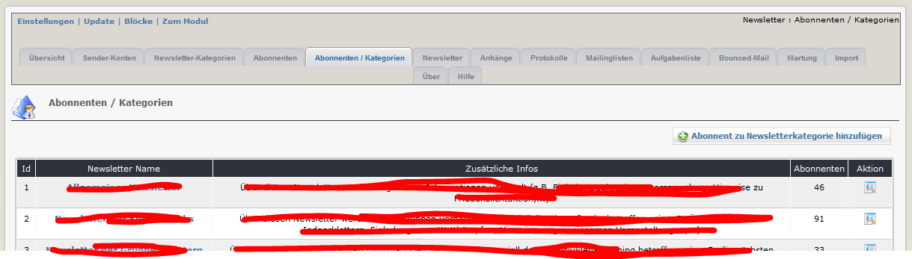
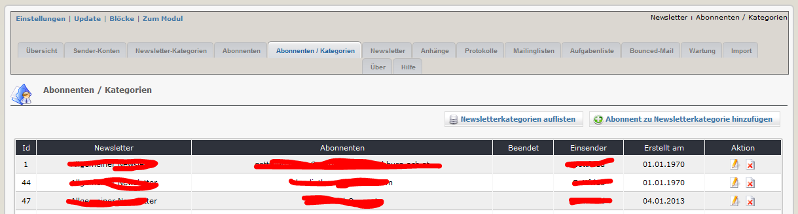
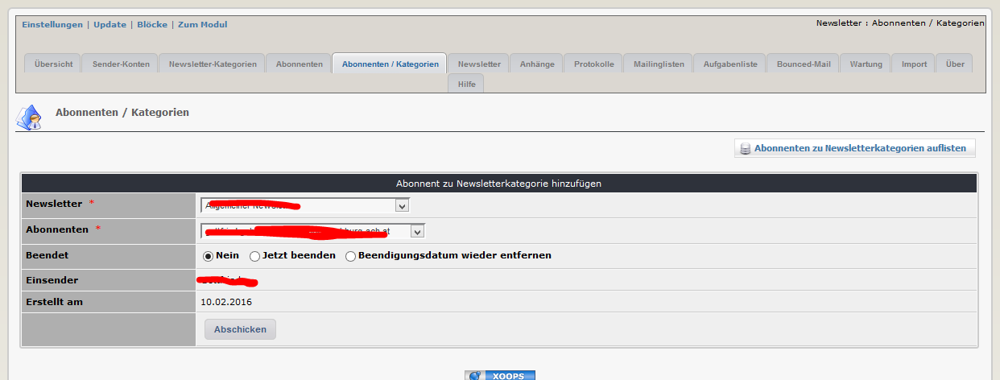

# 2.4 Abonnenten / Kategorie

Auf diesem Registerblatt erhalten sie eine Übersicht über die bestehenden Kategorien

In der Spalte "Abonnenten" sehen sie die Anzahl der Abonnenten zu dieser Kategorie.

Wenn sie auf den Kategorienamen oder auf "Details" klicken (), erhalten sie eine Liste der Abonnenten

Wenn sie wollen, können sie auch manuell einzelne Personen zu bestimmten Newsletterkategorien anmelden

Wenn ein Abonnement vom BMH beendet wurde, sehen sie hier auch das Datum der Beendigung.