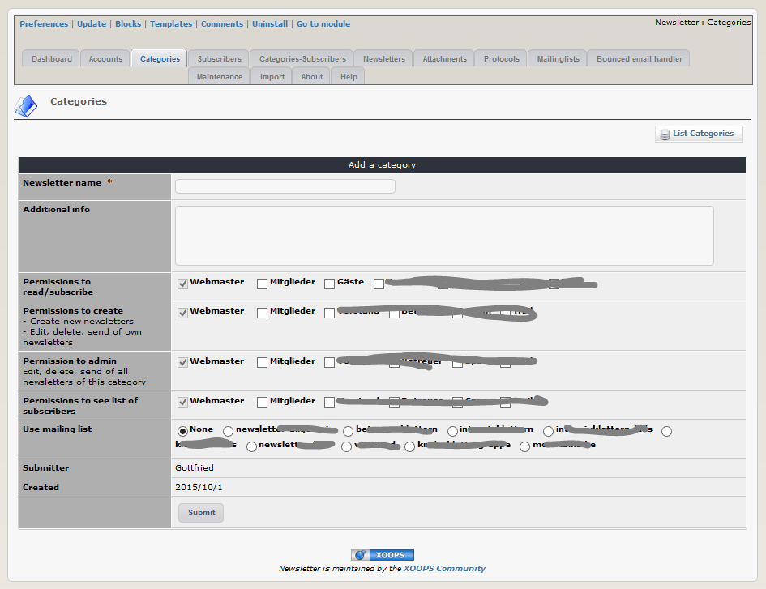

# 2.2 Newsletter categories

You can handle one or more newsletter categories. If you have a sports community you can e.g. create one general, one for each branch (football, biking, walking,...). 

#### Additional Info
This info will be shown to users to explain the reason/intention for this newsletter 

#### Permissions:
It is possible to set permissions to "read", "create", "admin" and "list subscribers" for each newsletter cat per user group.
1. read/subscribe: users of this group can read newsletters from this cat and he can subscribe to this cat
2. create: users of this group can
   - create new newsletters
   - edit, delete and send his newsletters, created by himself
3. admin: users of this group can
   - create new newsletters
   - edit, delete and send his newsletters, created by himself or by other users
4. see list subscribers: users of this group can see which persons have subcribed to this newsletter cat

If you have chosen the option for the usage of mailing lists and you have already defined the mailing lists, you can here decide, with which mailing list (un-)subscriptions should be synchronized.

