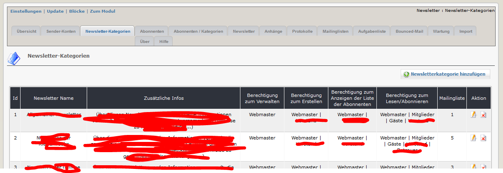

# 2.2 Newsletterkategorien

Sie können eine oder mehrere Newsletterkategorien verwalten. Wenn sie z.B. einen Sportverein haben, können sie z.B. einen allgemeine Kategorie erstellen sowie für jede Sektion (Fussball, Radfahren, Wandern,...) eine Kategorie anlegen. 

#### Zusätzliche Infos
Diese Information wird den Benutzer angezeigt, um die Gründe/den Zweck eines bestimmmten Newsletters zu erläutern

#### Berechtigungen:
Es ist möglich, die Berechtigungen "lesen", "erstellen", "administrieren" and "Abonennten auflisten" für jede Newsletterkategorie und je Gruppe zu setzen.
1. lesen/anmelden: Benutzer dieser Gruppe können die Newsletter dieser Kategorie lesen und auch abonnieren
2. erstellen: Benutzer dieser Gruppe können 
   - neue Newsletter erstellen
   - bearbeiten, löschen und senden der von ihm selbst erstellten Newsletter
3. administrieren:  Benutzer dieser Gruppe können 
   - neue Newsletter erstellen
   - bearbeiten, löschen und senden aller Newsletter, nicht nur der von ihm selbst erstellten
4. Liste der Abonnenten anzeigen: Benutzer dieser Gruppe können sehen, welche Personen sich für eine bestimmte Kategorie angemeldet haben

Wenn sie die Option Mailinglisten aktiviert haben, können sie hier auch definieren welche Mailingliste bei An-/Abmeldungen syncronisiert werden soll.