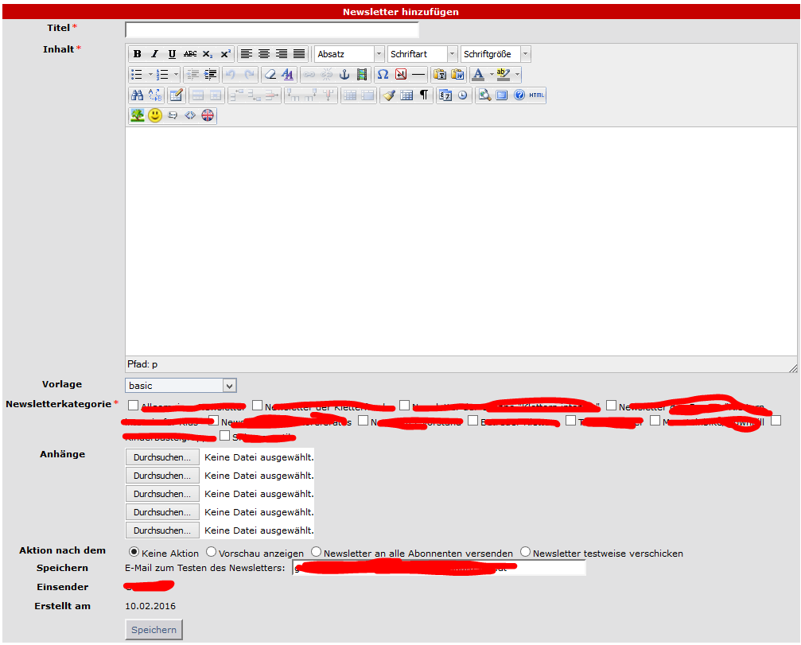

# 5.3 Newsletter erstellen

Wenn der aktuelle Benutzer das Recht zum Erstellen eines Newsletters besitzt, dann erhält er folgendes Formular:

Der Ersteller kann
* entscheiden, welches Template er verwenden will (für weitere Infos siehe [Bedienungsanleitung](4operations.md))
* an welche Newsletterkategorien er seinen Newsletter senden will (für weitere Infos siehe [Kategorien](categories.md))
* Anhänge hinzufügen

Er kann ebenso entscheiden, ob er
* den Newsletter sofort senden möchte
* eine Vorschau sehen möchte
* den Newsletter zu Testzwecken an ein bestimmte EMail-Adresse senden will
* momentan noch nichts tun will (nur speichern)