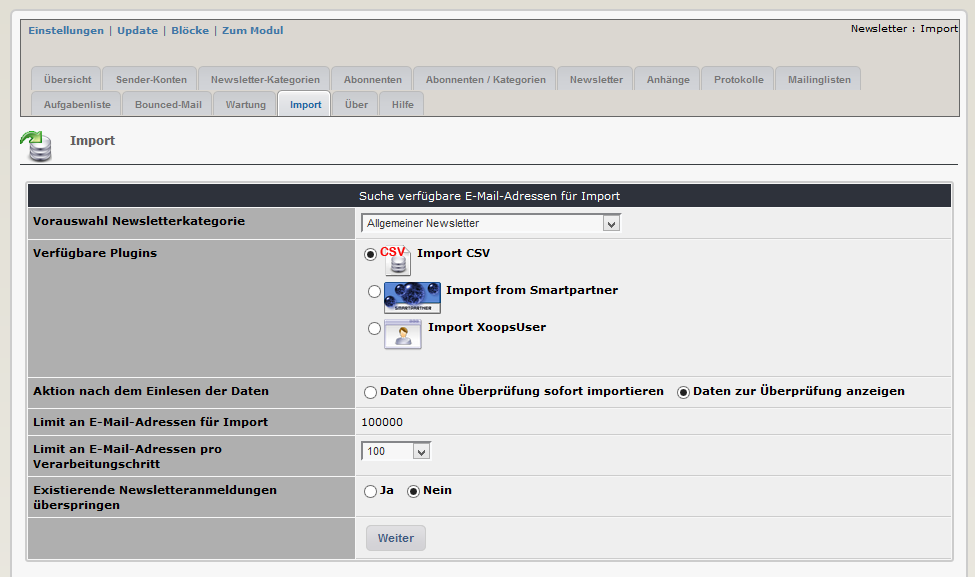

# 2.12 Import

Dieses Modul besitzt verschiedene Plug-Ins zum Importieren der Daten von anderen Newslettermodulen.

Für den Import stehen folgende Plug-Ins zur Verfügung:
- csv
- Modul rmbulletin
- Modul smartpartner
- Modul weblinks
- Modul evennews
- Modul subscribers
- Benutzer aus aktuellen Xoops users

Im Importtool werden unter "verfügbare plug-ins" werden nur jene Plug-Ins angezeigt, deren Module im aktuellen Xoops auch installiert sind.

Das Importtool arbeitet wie folgt:
- Hinzufügen der E-Mail zur Liste der Abonnenten
- Hinzufügen des Abonnenten zu einer Newsletterkategorie

Vor der Verwendung des Imorttools daher bitte mindestens eine Newsletterkategorie erstellen, da ansonsten die Email-Adressen keiner Kategorie zugeordnet werden können und daher kein Import erfolgt.

Es besteht die Möglichkeit,
- die zu importierenden E-Mail-Adressen ohne jegliche Prüfung zu importieren (empfohlen bei sehr großen Importmengen) oder
- nach dem Einlesen der Daten können Sie für e-Mail-Adresse noch überprüfen und entscheiden
-- ob Sie überhaupt importiert werden soll oder nicht
-- für welchen Newsletter die Anmeldung jeweils erfolgen soll

Wenn eine E-Mail-Adresse bereits registriert ist, sollte der Import dieser E-Mail übersprungen werden (standardmäßige Aktion).
Beispieldateien (sample1col.csv, sample4col.csv) für einen csv-Import finden Sie unter ../xNewsletter/plugins/ 

>**Achtung**:Bei den Registrierungen/Anmeldungen mit diesem Importtool werden keine E-Mail-Verständigungen an die jeweilige E-Mail-Adresse gesendet.

**Importieren von großen E-Maillisten:**

Um einen Speicherüberlauf zu verhindern, gibt es zwei Limits:
- Erstes Limit: es können nur 100000 Zeilen (z.B. aus einer csv-Datei) in der temporären Importtabelle gespeichert werden
- Zweites Limit: Sie können die Daten aus der temporären Tabelle in Paketen von max. 25000 endgültig importieren

Der Import von mehr als 100000 E-Mails kann wie folgt durchgeführt werden:
- Ersten Import durchführen E-Mail 1 bis 100000 - Engültigen Import E-Mails in Paketen von 25000 
- Zweiten Import durchführen E-Mail 100001 bis 200000 (Option "Existierende Newsletteranmeldungen überspringen"wählen) 
- Engültigen Import E-Mails in Paketen von 25000 und so weiter.
Wenn die Dateigröße die erlaubte Upload-Größe nicht übersteigt, kann dieser Vorgang so oft wiederholt werden, bis alle E-Mails importiert sind.

Sollten Sie eine weiße Seite erhalten, ist dies kein Problem, denn, wenn sie die Option "Existierende Newsletteranmeldungen überspringen" wählen, startet die Importroutine immer bei der ersten noch nicht importierten E-Mail-Adresse.
Reduzieren Sie in diesem Fall die Anzahl der zu importierenden EMails oder die Paketgröße und versuchen es einfach erneut.