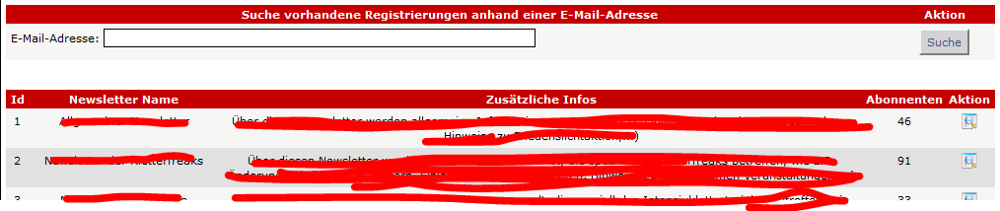
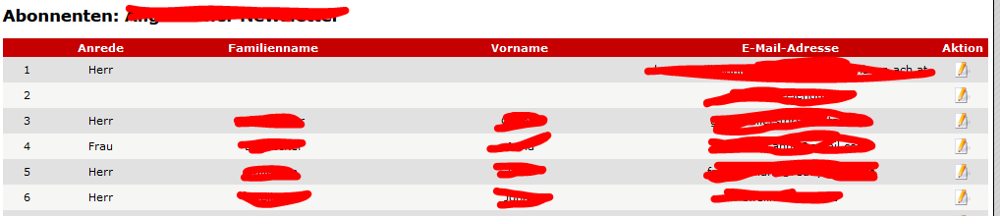

# 5.4 Liste der Abonnenten

Wenn der aktuelle Benutzer das Recht zum Auflisten der Abonnenten für Newsletterkategorien hat, so erhält er zuerst eine Auflistung jener Kategorien, für die er dieses Recht besitzt.

Für weitere Infos siehe [Berechtigungen](categories.md)

Wenn sie auf"Details anzeigen" (Spalte Aktion) klichen, erhalten sie eine Liste aller Abonnenten dieser Newsletterkategorie

Sie können auch nach einer EMail-Adresse suchen, um zu erfahren, bei welchen Newsletterkategorien diese EMail angemeldet ist.