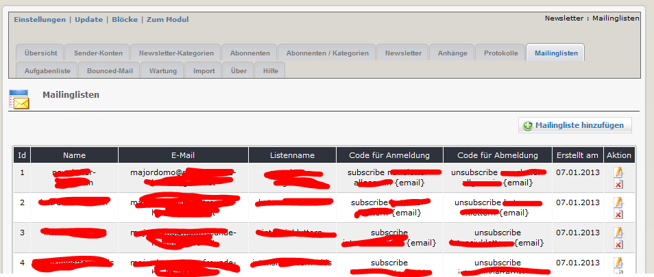
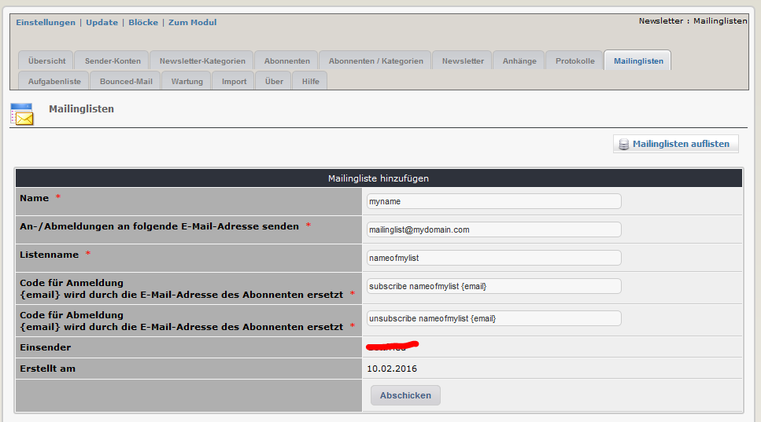

# 2.8 Mailinglisten

Auf diesem Registerblatt sehen sie eine Übersicht über die existierenden Mailinglisten. Dieses Registerblatt ist nur sichtbar, wenn sie in den Moduleinstellungen die Option "Verwende Zusatzfeature Mailinglisten" gewählt haben.

Sie können dem Newsletter-Modul neue Mailinglisten hinzufügen

Sie müssen dazu auch die EMail-Adresse angeben, an die der Befehl für die Syncronisation gesendet werden soll, und wie der Befehl selbst zu lauten hat.
Die vorschlagene Struktur entspricht Majordomo-Mailinglisten, für andere Mailinglisten kann es erforderlich sein, den Befehl entsprechend anzupassen.
