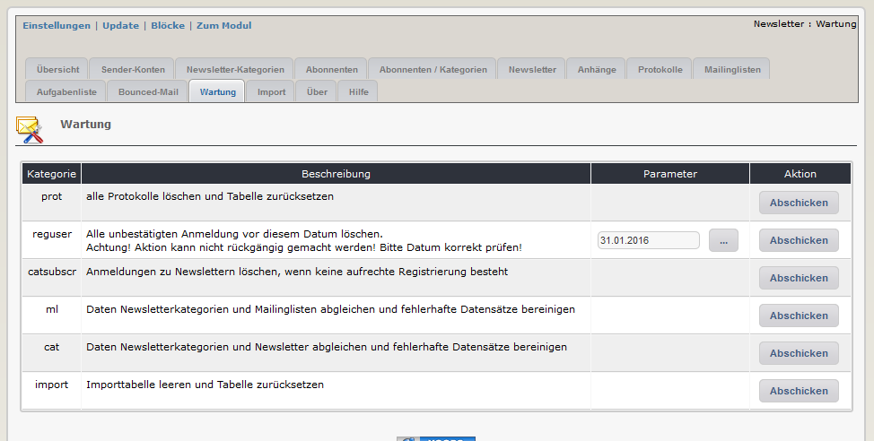

# 2.11 Wartung

Dieses Modul besitzt eine Wartungsfunktion, um verschiedene Fehler in der Datenstruktur zu beheben

Es wird empfohlen, diese Funktionen von Zeit zu Zeit durchzuführen, um die Daten sauber und die Datenmenge klein zu halten.