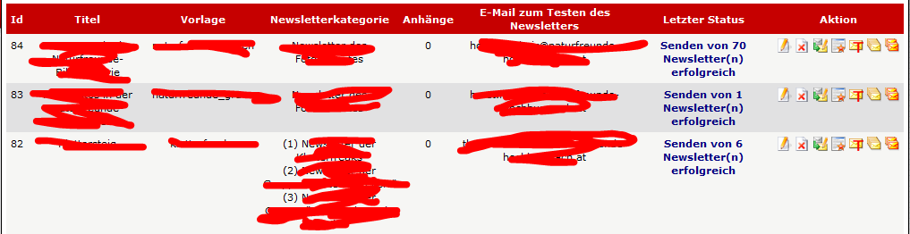

# 5.1 Newsletterlisten

Der Benutzer erhält eine Auflistung aller bereits gesendeten Newsletter, jedoch nur für jene Kategorien, für die seine Gruppe das Leserecht bestitzt.

Der Benutzer kann sich auch eine Vorschau des Newsletters anzeigen lassen.

Abhängig von den Rechten des aktuellen Benutzers werden zusätzlichen Möglichkeiten (Bearbeiten, Löschen, Senden,...) angeboten.

Für weitere Infos siehe [Newsletter](newsletters.md)