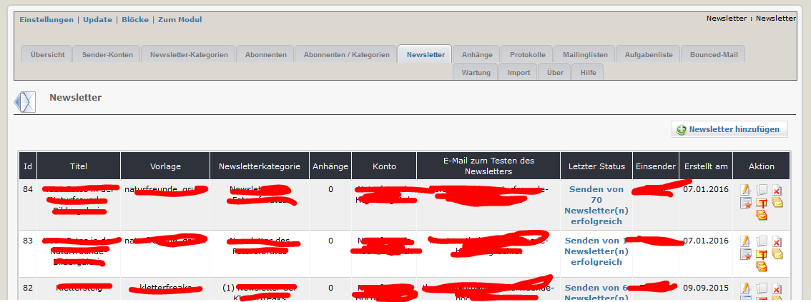
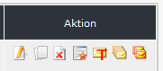

# 2.5 Newsletter

Auf diesem Registerblatt erhalten sie eine Übersicht über alle erfassten Newsletter.

In dieser Liste sehen sie auch
* das verwendete Template
* alle Kategorien, an die der Newsletter versendet wurde
* die Anzahl der Anhänge
* das zum Senden verwendete EMail-Konto
* E-Mail-Adresse für Testzwecke
* den letzten Status aus den Protokollen

#### Spalte Aktion

Mögliche Aktionen für Newsletter sind
*  bearbeiten
*  klonen
*  löschen
*  Vorschau anzeigen
*  an die Test-EMail-Adresse senden
*  allen Abonnenten senden
*  nur jenen Abonnenten senden, bei denen der letzte Sendeversuch fehlgeschlagen ist