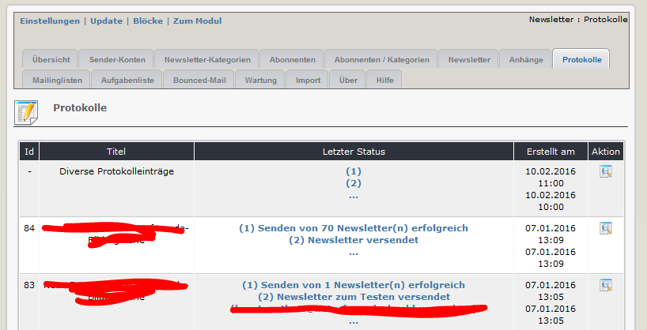
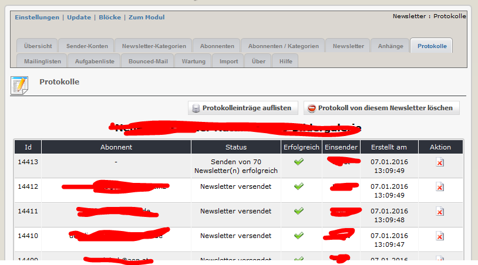

# 2.7 Protokolle

Auf diesen Registerblatt sehen sie eine Übersicht über alle Aktionen im Newsletter-Modul.

#### Diverse Protokolleinträge
Unter Diverse Protokolleinträge finden sie eine Dokumentation aller Aktivitäten, die nicht direkt mit einem bestimmten Newsletter zusammenhängen, wie z.B. An- und Abmeldungen Synchronisation mit Mailinglisten, Wartung des Moduls, und so weiter.

#### Newslettereinträge
Für jeden Newsletter können sie verschiedene Protokolleinträge ersehen 
* Erstellen und Speichern des Newsletters
* Sendeaktivitäten für jeden Abonnenten (erfolgreich/fehlgeschlagen)
* Zusammenfassendes Protokoll für den letzten Sendevorgang
* und so weiter

