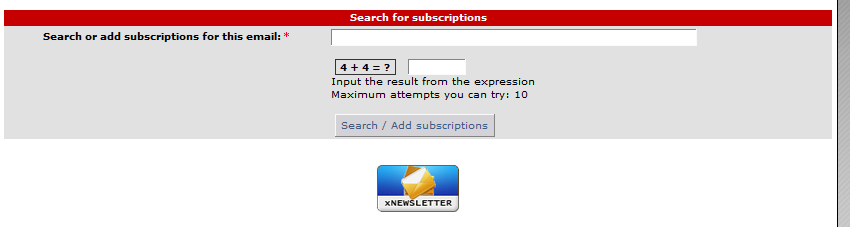
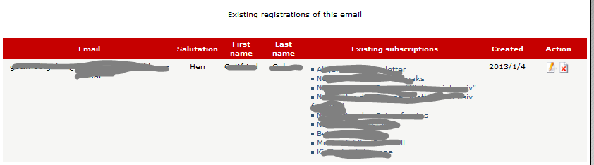
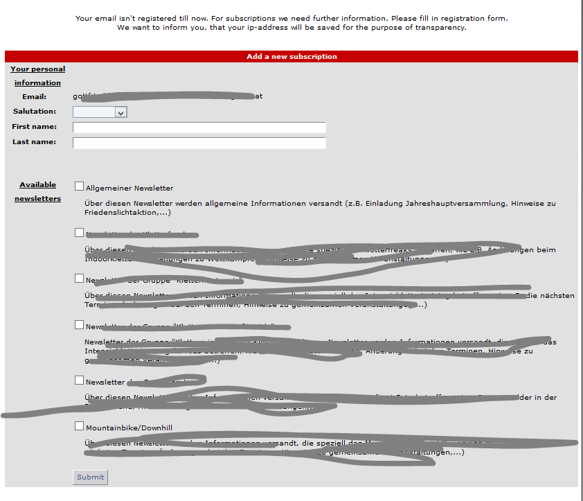

# 5.1 Subscribe and unsubscribe

If you are not logged in or your user account is not linked to a subscriber, you get first a form to enter your email address

if you enter your email and click on submit, then you get and overview about the existing subscriptions of this email.

If this email address isn't stored in the newsletter system, you get direclty to the form for subscription.

Under "Available newsletters" the user can see all newsletter cats, where his groups has the right to read.