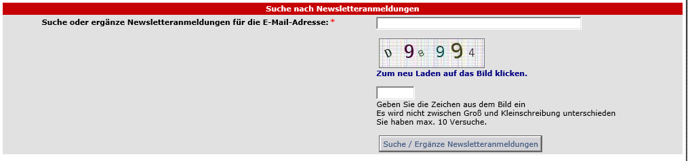
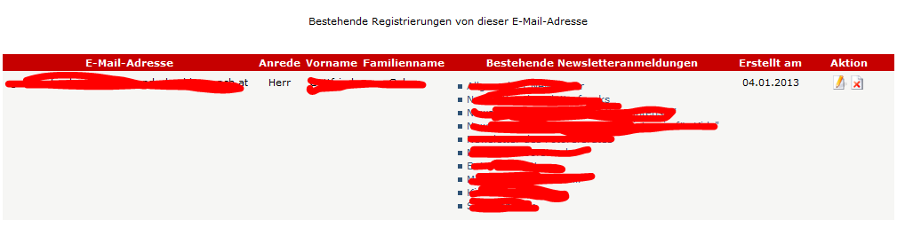
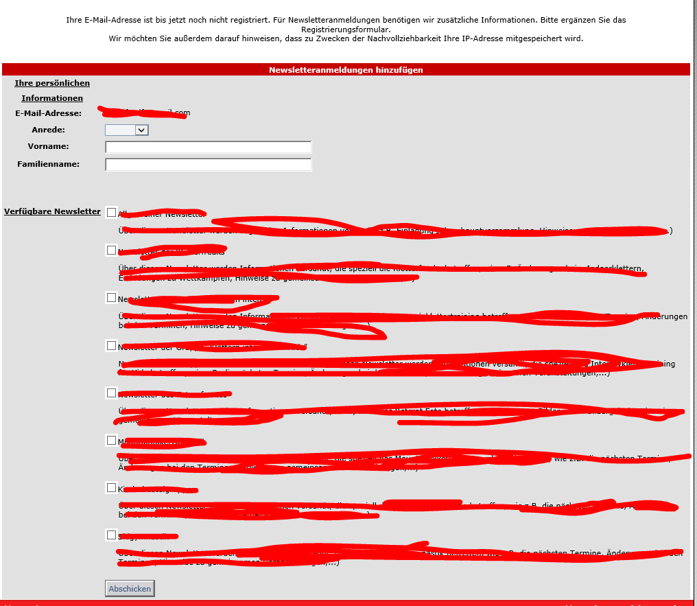

# 5.1 An- und Abmeldung

Wenn sie sich nicht als Benutzer angemeldet haben oder ihr Benutzerkonto nicht mit einen Abonnenten verknüpft ist, erhalten sie zuerst ein Formular für die Eingabe der EMail-Adresse

Wenn sie eine EMail-Adresse angeben und auf Senden klicken, dann erhalten sie eine Übersicht über die erfassten Anmeldungen dieser EMail-Adresse.

Ist die angegebene EMail-Adresse noch nicht im Newslettersystem erfasst, erhalten sie ein Formular für die Registrierung.

Unter "Verfügbare Newsletter" kann der Benutzer alle Newsletterkategorien sehen, für die er das Leserecht besitzt.