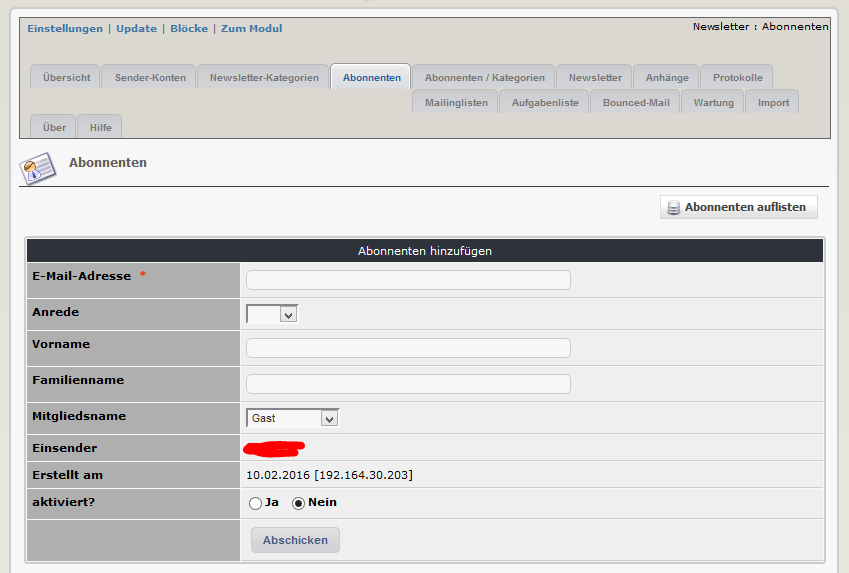

# 2.3 Abonnenten

Jeder Abonnent wird nur einmal in der Datenbank gespeichert. Nach dem Speichern kann sich dieser zu den einzelnen Newsletterkategorien anmelden.

Auf diesem Registerblatt sehen sie eine Liste aller Personen, die sich zumindest für eine Newsletterkategorie angemeldet haben.

Neben dem Erstelldatum ersehen sie den aktuellen Status:
*  der Abonnent hat bis jetzt das Bestätigungsmail noch nicht gesendet
*  das Bestätigungsmail wurde gesendet
 
Sie haben auch die Möglichkeit, einzelne Personen der Datenbank manuell hinzuzufügen
