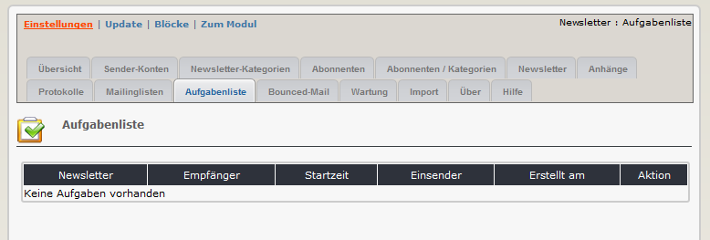

# 2.9 Aufgabenliste

Auf diesem Registerblatt sehen sie eine Übersicht über alle noch offenen Aufgaben (Senden des Newsletters).
Dieses Registerblatt ist nur sichtbar, wenn in den Moduleinstellungen die Option "E-Mails paketweise versenden" einen Wert größer 0 besitzt.

Wenn sie diese Option verwenden, sehen sie hier alle Newsletter, die auf eine Sendeaktion ihres Cronjobs warten, sowie die Zeit, wann die Sendeaktion starten sollte.

