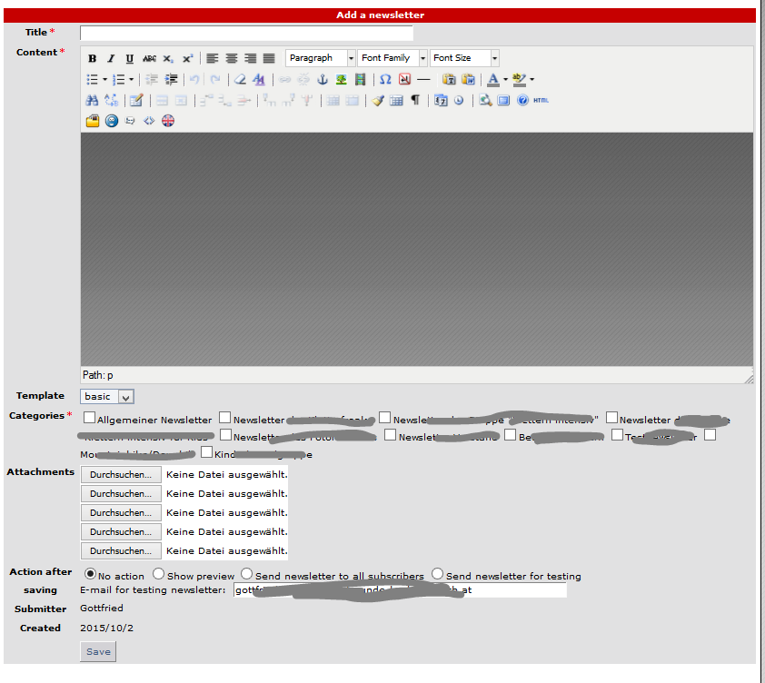

# 5.3 Create newsletter

If current user has the right to create a newsletter, he get a form:

The creator can
* decide, which template he will use (for more info see [Operating Instructions](4operations.md))
* to which newsletter cats he want to send the newsletter (for more info see [Categories](categories.md))
* add attachments

He can also decide, whether he want to 
* send the newsletter immediately
* see preview
* sent newsletter as a test to his own email
* do nothing for the moment (only saving)