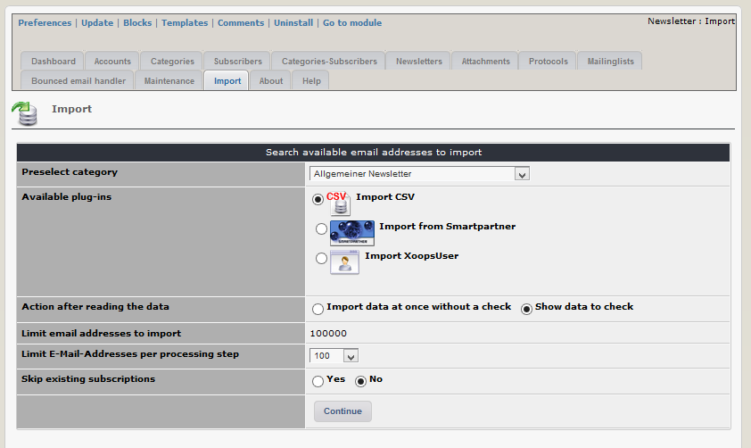

# 2.12 Import

This module has also plugins to import data from other newsletter modules.

You can import data with various plug-ins:
- csv
- module rmbulletin
- module smartpartner
- module weblinks
- module evennews
- module subscribers
- users from xoops users

In the import tool under "Available plug-ins" you see only plugins for modules, which are actually installed in your xoops.
 
The import tool works in this way:
- Adding email to the list of subscribers
- Subscribe this email to one newsletter cat

Before you run import tool therefore, please create first minimum one newsletter cat, otherwise the email cannot be subscribed to a cat and the import fails.

You have the possibility
- to import the E-Mail-Addresses without any check (recommended for big import data sets) or
- after reading data you can decide for each email
-- whether you want to make a subscription or not
-- to which newsletter you want to make the subscription

If an email is already registered, import of this email should be skipped (default action, do not touch existing registrations). 
Sample files (sample1col.csv, sample4col.csv) for csv-import you can find in ../xnewsletter/plugins/ 

>**Attention**:In case of registrations/subscription with this import tool there will not be sent an email notification to the email owner.

**Importation of big email lists:**

To avoid cache overflow during importation, there are two limits:
- first limit: only 100000 lines (e.g. of a csv-file) can be stored in temporary import table
- second limit: you can finally import data from temporary import table in packages of max. 25000

For import of more than 100k emails following procedure can be done:
- run first import email 1 to 100000 - import finally emails in packages of 25k - run second import emails 100001 to 200000 (select option "skip existing subscriptions") - import finally in packages of 25k and so on.
If file size is not too big to upload, you can repeat as often you want.

If you get somewhere a white page, it is no problem because if option "skip existing subscriptions" is selected the import procedure restart at the first not imported email-address.
Reduce number of importing emails or package size and try again.