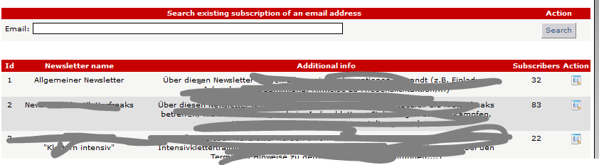
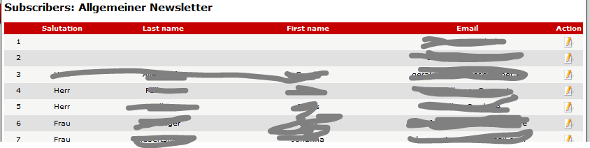

# List subscribers

If current user has the right to list subscribers of a newsletter, he get a list of newsletter cats, where he has this right  For further information see [Permissions](../administration-menu/categories.md)

If you click on "Show Details" \(column Action\) you get the list of all subscribers to this newsletter cat 

You can also search for an email address/person, in order to know, to which categories this email has been subscribed.

